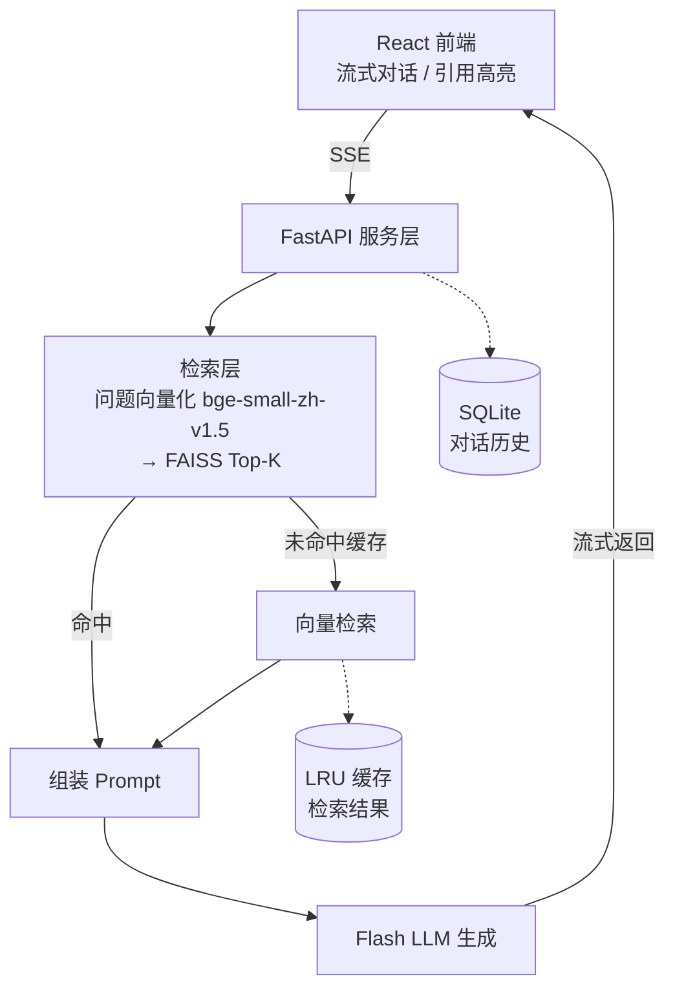

# MinFa-RAG-Flash

基于检索增强生成（RAG）的轻量《民法典》问答系统。用自然语言提问，得到引用具体法条的专业回答。

> **核心课题**：通过优化检索质量与提示词设计，缩小 Flash 型 LLM 在法律问答任务上与旗舰模型的差距——用可量化的评测数据证明。

[](LICENSE)
[](https://www.python.org/)

## 🔮 功能特性

- 🔍 **条文级检索** —— 按「第 X 条」结构精准切分《民法典》，检索天然对齐法条单位
- 💬 **自然语言问答** —— 通俗提问，专业回答，附带法条引用
- 🎯 **引用溯源** —— 每个答案标注对应法条出处与相似度，可核对
- ⚡ **近零成本运行** ——  Flash 型 LLM API + 本地向量模型
- 🌐 **REST API** —— FastAPI 后端，可独立部署，也可作为其他 Agent 系统的工具被调用
- ⌨️ **Web 对话界面** —— React 前端，流式输出、法条引用可点击溯源、历史对话可回看

## ⭕ 为什么叫 MinFa-RAG-Flash？

因为我喜欢 Flash 型 LLM ——小、快、成本低。旗舰模型的效果固然好，但成本高；Flash 型LLM便宜，但推理能力有限。

我想试试：**是否可以通过把 RAG 系统做得足够好（检索准、切分对、提示词调优到位），缩小「过时」的 Flash 型 LLM 在法律问答任务上与旗舰模型的差距。**

后续会用同一套评测题集，对 Flash 模型与旗舰模型做横向对比，评测结果将发布在「性能指标」一节。

## 🚀 快速开始

> ⚠️ 开发中，以下为预期使用方式（功能完成后生效）。

### 环境要求

- Python 3.10+
- 阿里云百炼 API Key（[注册开通](https://bailian.console.aliyun.com/)）

### 安装

```bash
git clone https://github.com/3165zz/MinFa-RAG-Flash.git
cd MinFa-RAG-Flash

# 创建虚拟环境
python -m venv venv
# Windows
venv\Scripts\activate
# macOS / Linux
# source venv/bin/activate

pip install -r requirements.txt
```

### 配置

在项目根目录创建 `.env` 文件：

```
DASHSCOPE_API_KEY=你的key
```

### 使用

```bash
# 首次运行：构建《民法典》向量知识库
python build_index.py

# 启动问答
python main.py
```

按提示输入法律问题，即可获得附带法条引用的回答。


## 🌆 架构



**技术选型一览**

| 环节 | 选型 | 理由 |
|---|---|---|
| LLM | 某 Flash 型　LLM | 高性价比API |
| 向量模型 | BAAI / bge-small-zh-v1.5 | 中文效果好，模型小，CPU 即可运行 |
| 向量库 | FAISS | 单机够用，轻量高效 |
| 文本切分 | 按「条」切分 | 法条天然是分块单位，检索质量高一档 |
| 后端服务 | FastAPI | 契合 REST API 集成需求，自动生成接口文档 |
| 评测（计划） | 自建题集 + Flash/旗舰横向对比 | 用数据验证核心课题 |
| 应用框架（v3 起引入） | LangChain / LangGraph | 先裸写原理、再用框架重构，v5 用于 Multi-Agent 编排 |
| 前端 | React + Vite | 组件生态成熟，流式对话界面开发效率高 |
| 对话存储 | SQLite | 单文件零配置，v2 起持久化对话历史，可平滑升级 PostgreSQL |
| 检索缓存 | 进程内 LRU | 重复/高频问题直接命中，跳过向量检索 |


## 📊 性能指标

⚠️ 项目开发中。本节先固定**评测设计**，实测数据将于 v4 评测完成后填充。

### 消融实验设计

核心课题：**当检索把正确的法条稳定送入上下文时，Flash 型 LLM 能否达到逊于旗舰模型的可用水准？**

为分离「模型能力」与「检索质量」两个变量，设置四组对照：

| 组别 | 模型 | 检索 | 验证目标 |
|:---:|---|:---:|---|
| A | qwen3.5-flash（暂定） | ✅ 本系统 | 完整方案的实际水准 |
| B | qwen3.5-flash（暂定） | ❌ 裸答 | RAG 为小模型带来多少增益 |
| C | qwen3.8-max（暂定） | ❌ 裸答 | 质量基准线 |
| D | qwen3.8-max（暂定） | ✅ 同一套 RAG | 检索是否拖后腿 / RAG 增益是否通用 |

结果判读：

- **A ≈ C** → 核心课题成立：小模型 + 好 RAG 以近零成本逼近旗舰裸答
- **A ≫ B** → RAG 增益显著，方案有价值
- **D > A** → 剩余差距来自模型本身，而非检索不行

### 评测方法

- **评测集**：自建 50+ 题，三类覆盖：事实检索型 / 法条推理型 / 跨条文综合型
- **检索指标**：Top-5 命中率、MRR（以人工标注相关法条为准）
- **回答质量**：LLM-as-Judge（由**非参赛模型**担任裁判，按细则盲评打分）+ 人工抽检 20% 校准
- **裁判中立性**：裁判模型不参与 A/B/C/D 任何一组生成；打分时对四组输出**匿名化、乱序**，避免顺序偏差与来源偏差
- **控制变量**：temperature=0；四组同窗口完成调用；固定题目顺序；API限速重试

### 成本模型（预期，实测后填充）

| 方案 | LLM 成本 | 检索成本 | 预期质量 |
|---|---|---|---|
| C：旗舰裸答 | 较高 | — | 基准 100% |
| B：Flash 裸答 | 极低 | — | 预期低于可用线 |
| **A：Flash + 本 RAG** | **极低** | 本地向量，近零 | **目标 ≥ 90% 基准** |
| D：旗舰 + 本 RAG | 较高 | 近零 | ≥ 基准 |

### 实测结果

（v4 填充：命中率 / MRR / 四组得分对比）

## 🧭 Roadmap

- [ ] **v1 核心链路**：命令行问答跑通（切分 → 向量化 → 检索 → 生成）
- [ ] **v2 服务化**：FastAPI 后端 + SSE 流式接口 + React 对话前端（流式输出、法条引用高亮）+ 对话历史 SQLite 持久化
- [ ] **v3 效果与性能优化**：查询改写、混合检索（BM25 + 向量）、重排序；检索结果 LRU 缓存（命中免检索）；引入 LangChain 重构检索链

- [ ] **v4 评测验证**：自建评测题集，Flash vs 旗舰模型横向对比，产出性能报告
- [　] **v5 Agent 化**（未确定）：基于 LangGraph 将 RAG 封装为工具，接入 Multi-Agent 系统（这可能是我下一个项目的方向）

## 🤝 贡献

欢迎提交 Issue 与 Pull Request。

## 📄 许可证

本项目基于 [MIT License](LICENSE) 开源。

## ⚠️ 免责声明

本系统输出仅供参考与学习用途，**不构成正式法律意见**。涉及具体法律事务，请咨询专业律师。